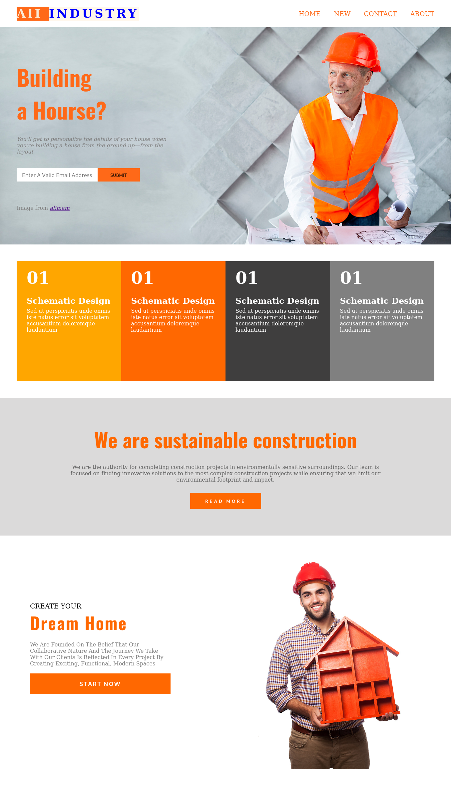
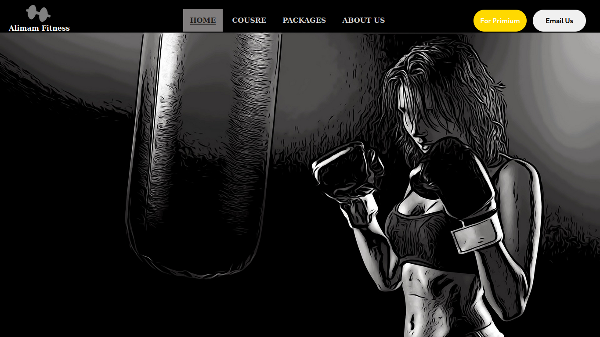
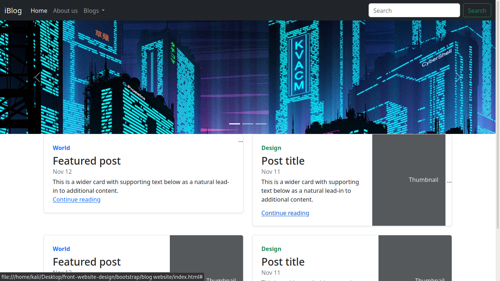
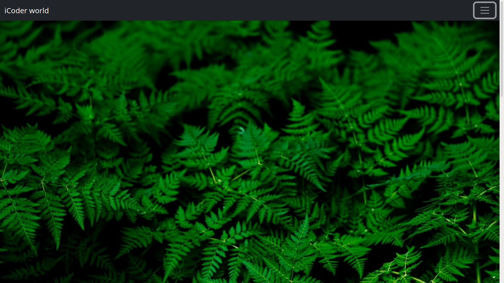
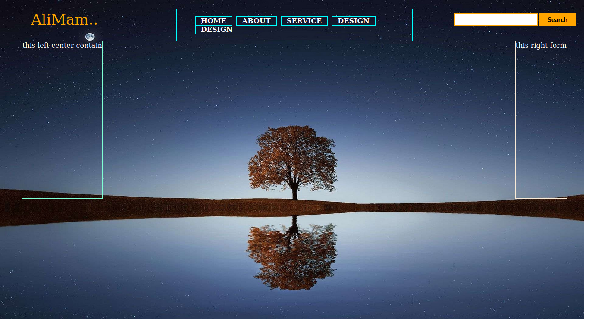

# front-website-design
* this repo cantain website frontent design  
* having responsive 
* Bueatifull website
* interactive landing pages
* using SASS, ES6/ES7.
* some website contain cool animation 

# Profactional Bilding House Industry Personal Website

* Fade-right, Fade-left, Zoom-in Animation.
* Card Droping when open in Phones. 
* auto adpate the Responsiveness.
## In Desktop and Laptop Screen how looks? 

## In Phone Screen 

* There I learnt how to animation add in Element without lossing animation.

# Turisum Website Design for Hotals. 

* For Hicking 
* leaving in Lotel
* Bueatifull Landing page
* and Better Interation

* there I learnt how to fixed the Design issuss Like (position)

# iCoder website with Bootstrap 

* raponsive naviagtion 
* Drop down
* loging bar
* search functionality
* there i learn lot, How to use  Custom in Bootstrap 

# Google map Clone

## Funcationalty

* Real time Intrestion
* ctrl+ scrool Enable the zoom ablity.
* contact particular logituat , letitute
* Adabtive Devices

# Men Fastion Commersol website
  

* Hight Responsive for Phone Desktop Leptop

# Mordern Gaming Website Design 

* Neon buttons 
* Responsive Navbar
* Organise Cards

<!--  -->
# Music player in Website Design
  

 # Gym Website front page
  

 # Glassy website inside the progress bars

  

 # JavaScript coundDown Website
  

 <!-- # bootstrap website
   -->
 
 <!-- # iCoder website frontpages
   -->

 <!-- # Arean of website war

   -->

